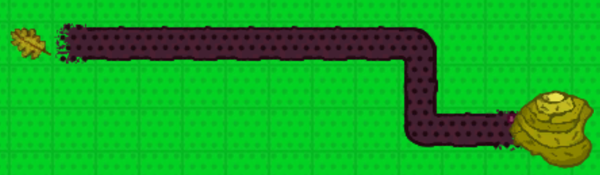

# Ant World

In this game you need to help the Leaf-Cutter Ants find their way to the different colored leafs that keep falling to the forrest ground. 

The game is somewhat inspired by [Mini Motorways](https://dinopoloclub.com/games/mini-motorways/), where the player needs to build the road-network within a growing city.

Similarly, in this game you are tasked with connecting the Anthills to the corresponding leafs. You can draw a road by entering the "Road Placement" mode, clicking your mouse at the start position and dragging it across the screen until you release it at the destination.
There are four different types of ants, as indicated by the anthill and leaf color. 

You get points for every ant that successfully makes its way to a leaf and returns to the anthill. 
If at any point the ants are not able to return fast enough, a timer is started. If you don't get an ant back to the anthill before time runs out you lose!
Ants are particularly slow at crossroads and whenever they run into each other, so make sure you build efficient roadnetworks.

